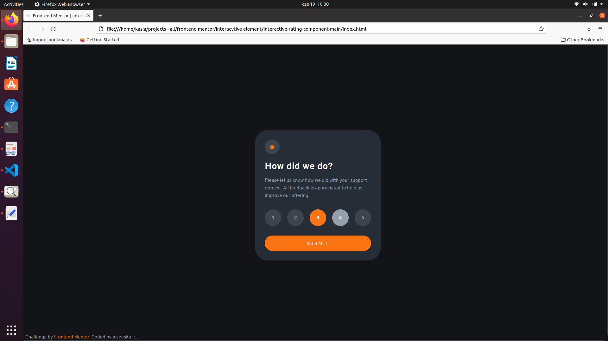
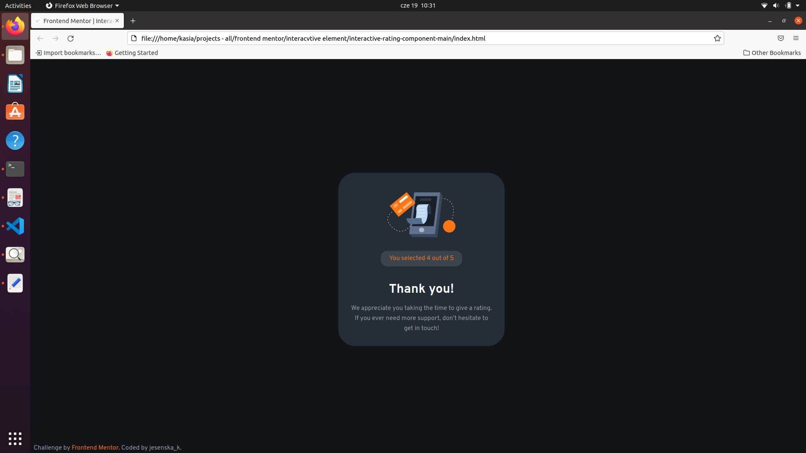

# Frontend Mentor - Interactive rating component solution

This is a solution to the [Interactive rating component challenge on Frontend Mentor](https://www.frontendmentor.io/challenges/interactive-rating-component-koxpeBUmI). 

## Table of contents

- [Overview](#overview)
  - [The challenge](#the-challenge)
  - [Screenshot](#screenshot)
  - [Links](#links)
- [My process](#my-process)
  - [Built with](#built-with)
  - [What I learned](#what-i-learned)
  - [Continued development](#continued-development)
  - [Useful resources](#useful-resources)
- [Author](#author)


## Overview

### The challenge

Users should be able to:

- View the optimal layout for the app depending on their device's screen size
- See hover states for all interactive elements on the page
- Select and submit a number rating
- See the "Thank you" card state after submitting a rating

### Screenshot




### Links

- Solution URL: [](https://your-solution-url.com)
- Live Site URL: [](https://your-live-site-url.com)

## My process

### Built with

- Semantic HTML5 markup
- CSS custom properties
- Flexbox
- JS DOM manipulation

### What I learned

- Working with a group of buttons.
- Change element style using DOM manipulation.
- Working with design template.

The most challenging part was writing my JS function for group of buttons. I usually use some frameworks to handle DOM manipulation so slicing it into step-by-step instructions wasn't intuitive for me.

```js
const group = document.getElementById("btn-group");
const groupBtns = group.querySelectorAll("button");
const userRating = document.getElementById("rate-val");

let chosenRating = 0;

function buttonHandler() {
  for (let i = 0; i < groupBtns.length; i++) {
    groupBtns[i].addEventListener("click", (event) => {
      let currentValueBtn = document.querySelector(".active-btn");
      if (currentValueBtn) {
        currentValueBtn.className = currentValueBtn.className.replace(
          "active-btn",
          ""
        );
      }
      const clicked = event.target;
      clicked.classList.add("active-btn");
      chosenRating = event.target.value;
    });
  }
}
```

The other challenging part was working with design provided as screenshoots. I try to measure it and write reusable elements but, as always in this kind of situation, I'm not sure if my solution is optimal.

### Continued development

In the next projects, I would like to try to coordinate informations from many simple components communicating with each other. 

### Useful resources

- [Portfolio Website Tutorial](https://www.youtube.com/watch?v=xV7S8BhIeBo&t=2913s) - Although I was watching (and coding along with) this tutorial some time ago, I remember and used some solutions provided by its author. Thanks to this experience I knew what to do in this project from the first glance (e.g. changing style using JS, use translateX to show and hide windows). 
- [MDN Web Docs - CSS Reference](https://developer.mozilla.org/pl/docs/Web/CSS/Reference) - I still don't remember many names for CSS properities. Documentation helps me a lot.

## Author

- Frontend Mentor - [@kmnkat](https://www.frontendmentor.io/profile/kmnkat)
